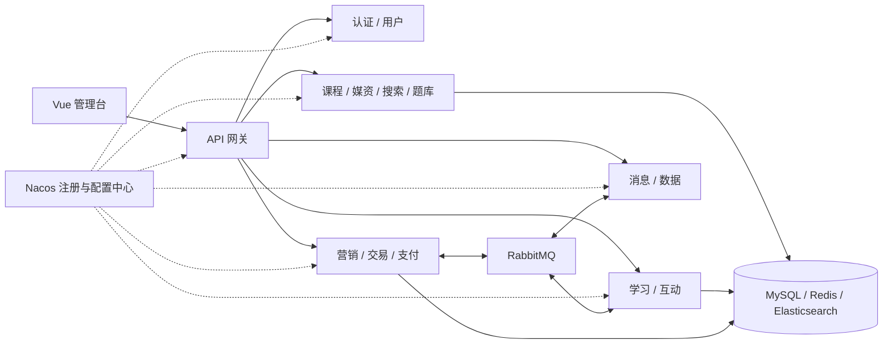

# 天机学堂 · Tianji

基于 Spring Cloud 与 Vue 3 的在线教育微服务项目，覆盖课程管理、学习互动、优惠营销、订单支付和运营管理。

本仓库包含 Java 后端与 Vue 管理台，适合用于学习微服务拆分、跨服务调用、异步消息和教育业务建模。

[快速开始](#快速开始) · [服务架构](#服务架构) · [配置说明](docs/configuration.md) · [参与贡献](#参与贡献)

## 功能概览

| 业务领域 | 主要能力 |
| --- | --- |
| 用户与权限 | 学员、教师、员工管理，登录认证，角色、菜单与权限管理 |
| 课程与内容 | 课程分类、课程目录、媒资管理、题库与课程检索 |
| 学习与互动 | 课表与学习计划、学习记录、问答、笔记、签到、积分与排行榜 |
| 营销与交易 | 优惠券、兑换码、优惠计算、购物车、订单、支付与退款 |
| 消息与运营 | 站内信、通知、短信集成及运营数据统计 |

**仓库范围：** 当前提供管理台前端和后端服务源码，不包含学员端前端、数据库初始化 SQL、业务数据或可直接导入的完整 Nacos 配置。完整运行需要自行准备这些资源；支付、短信与云媒资还需要相应的平台账号。

## 技术栈

下列版本来自项目依赖声明。

| 层级 | 技术 |
| --- | --- |
| 后端基础 | Java 11、Spring Boot 2.7.2、Spring Cloud 2021.0.3 |
| 微服务 | Spring Cloud Alibaba 2021.0.1.0、Nacos、Gateway、OpenFeign |
| 数据与缓存 | MySQL、MyBatis-Plus 3.4.3、Redis、Redisson 3.13.6 |
| 消息与任务 | RabbitMQ、XXL-JOB 2.3.1、Seata 1.5.1 |
| 检索 | Elasticsearch 7.12.1 客户端 |
| 接口文档 | Knife4j |
| 管理台 | Vue 3、Vite 2、Element Plus、Pinia、Vue Router、ECharts |

## 服务架构



| 模块 | 职责 | 默认端口 |
| --- | --- | --- |
| `tj-gateway` | 请求路由与网关鉴权 | 10010 |
| `tj-auth` | 认证服务及鉴权 SDK | 8081 |
| `tj-user` | 学员、教师与员工 | 8082 |
| `tj-search` | 课程搜索与兴趣管理 | 8083 |
| `tj-media` | 文件上传与视频媒资 | 8084 |
| `tj-message` | 通知、站内信与短信 | 8085 |
| `tj-course` | 课程与目录 | 8086 |
| `tj-pay` | 支付渠道、支付与退款 | 8087 |
| `tj-trade` | 购物车与订单 | 8088 |
| `tj-exam` | 题库与题目管理 | 8089 |
| `tj-learning` | 学习记录、问答、笔记与积分 | 8090 |
| `tj-remark` | 点赞互动 | 8091 |
| `tj-promotion` | 优惠券与促销 | 8092 |
| `tj-data` | 运营数据 | 8093 |
| `tj-common` / `tj-api` | 公共组件、DTO 与服务调用接口 | — |

## 目录结构

```text
tianji/
├── backend/                # Maven 多模块后端
│   ├── pom.xml             # 聚合模块与依赖版本管理
│   ├── tj-common/          # 通用组件
│   ├── tj-api/             # 跨服务接口
│   ├── tj-auth/            # 认证服务与 SDK
│   └── tj-*/               # 业务服务
├── frontend/               # Vue 管理台
│   ├── src/api/            # 接口请求
│   ├── src/pages/          # 业务页面
│   ├── src/components/     # 公共组件
│   └── .env.example        # 开发环境示例
└── docs/
    └── configuration.md    # 外部依赖、Nacos 与密钥配置
```

## 快速开始

### 1. 获取代码

```bash
git clone https://github.com/fzc70/tianji.git
cd tianji
```

### 2. 启动管理台

安装 Node.js 与 npm 后执行：

```bash
cd frontend
npm ci
cp .env.example .env.local
npm run dev
```

PowerShell 中使用 `Copy-Item .env.example .env.local` 复制配置。

浏览器访问 [localhost:18081](http://localhost:18081)。开发请求通过 `/api` 转发至 `http://localhost:10010`，可在 `.env.local` 中修改 `API_PROXY_TARGET`。仅启动前端可以打开登录页面，业务操作需要已配置并运行的后端服务。

构建静态资源：

```bash
npm run build
```

产物位于 `frontend/dist/`。生产环境需由 Web 服务器将 `/api/*` 转发到后端网关并移除 `/api` 前缀；Vite 的开发代理不会包含在静态产物中。

### 3. 配置后端依赖

准备 JDK 11、Maven，以及 MySQL、Redis、Nacos、RabbitMQ。检索、分布式任务和事务功能分别依赖 Elasticsearch、XXL-JOB 与 Seata。

按照[配置说明](docs/configuration.md)完成以下设置：

1. 为所需服务准备数据库表结构与初始权限数据。
2. 在 Nacos 中创建服务引用的共享配置，确保配置与服务发现使用相同命名空间。
3. 为认证服务生成独立的 JWT 密钥库，并通过环境变量传入路径和密码。
4. 按使用范围配置支付、短信和云媒资凭据。

### 4. 构建与启动后端

在仓库根目录执行：

```bash
cd backend
mvn "-Dmaven.test.skip=true" package
```

构建成功后，先启动认证、用户与网关，再按业务需求启动其他服务。例如：

```bash
java -jar tj-auth/tj-auth-service/target/tj-auth-service.jar
java -jar tj-user/target/tj-user.jar
java -jar tj-gateway/target/tj-gateway.jar
```

每个命令在独立终端运行。运行环境变量须在启动对应 JVM 前设置。接口文档由启用 Knife4j 的业务服务提供，例如用户服务的 [localhost:8082/doc.html](http://localhost:8082/doc.html)。

现有测试包含依赖数据库、中间件或第三方平台的集成测试，也包含演示性测试。运行 `mvn test` 前请准备独立测试环境；上述构建命令跳过测试编译与执行，不代表完整业务验证。

## 配置与凭据

- 后端通过 `${ENV_NAME}` 读取密码、密钥和平台账号，仓库不提供可用凭据。
- `.env.local`、本地配置、密钥库、证书、依赖目录与构建产物均由 `.gitignore` 排除。
- `VITE_*` 配置会进入浏览器代码，只能填写公开地址等非敏感内容。
- 仓库不提供默认登录账号，请通过自己的数据库初始化流程创建管理员。

## 参与贡献

欢迎通过 [Issues](https://github.com/fzc70/tianji/issues)反馈问题，附上复现步骤、运行版本和已脱敏日志。提交 Pull Request 时请说明问题、变更内容与验证方式，使用 UTF-8 编码，并避免提交本地配置或生成文件。

## 许可

第三方依赖、字体、图标及 UI 素材保留各自许可要求。本仓库暂未声明统一开源许可证。
